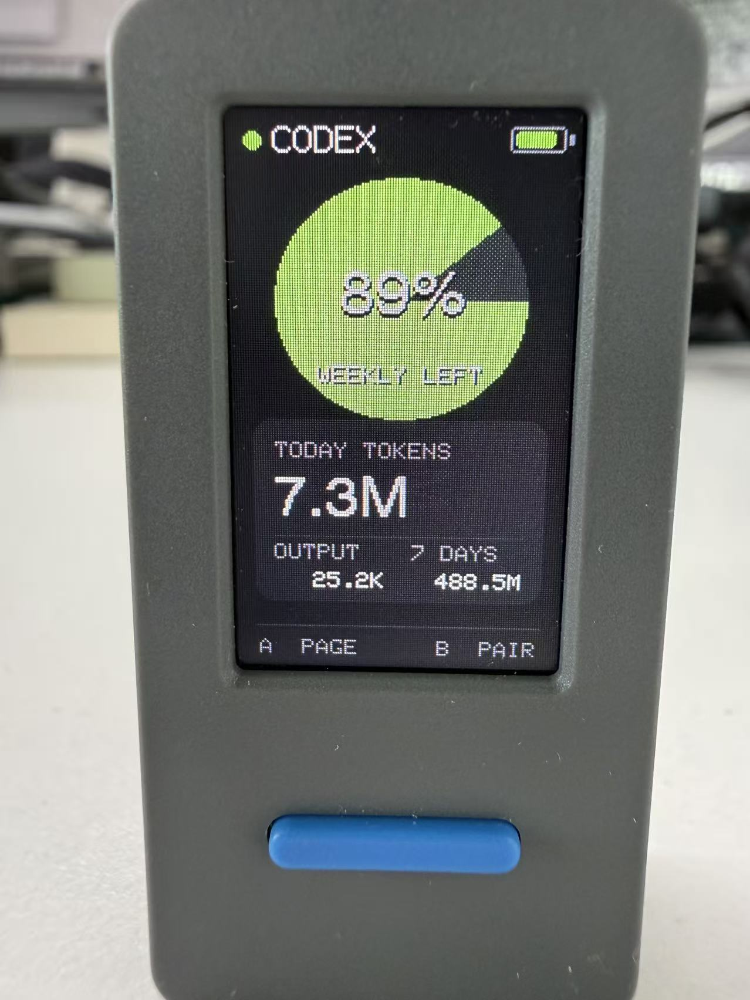
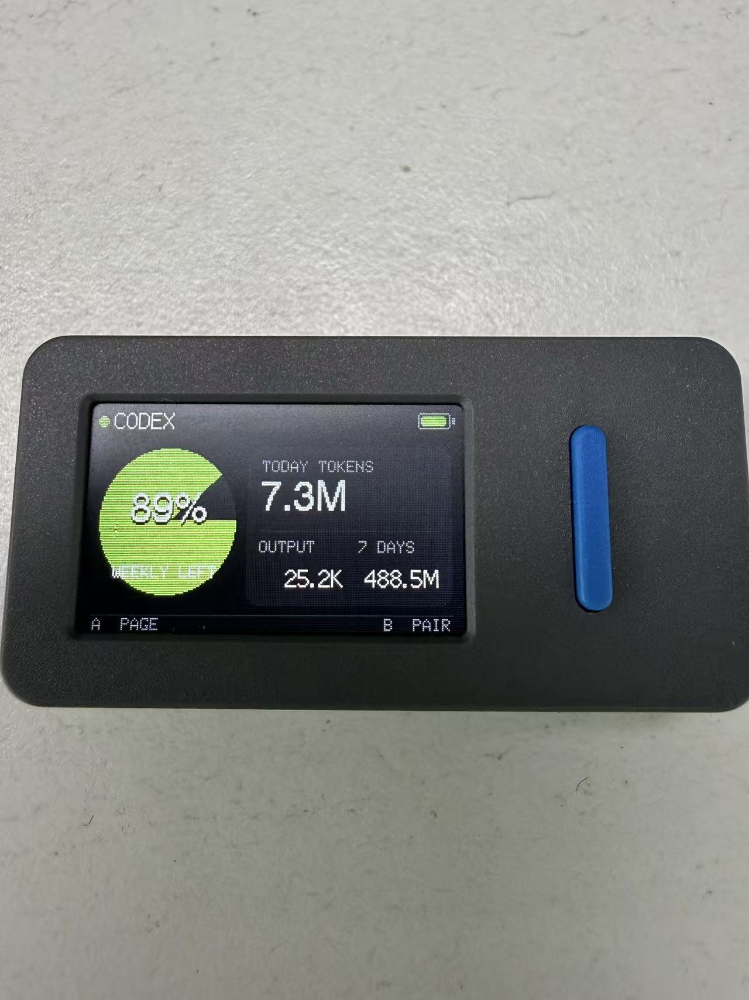

# CodexMeter

**English** | [简体中文](README.zh-CN.md)

A low-power Bluetooth dashboard that displays local Codex usage on an M5StickS3.

The desktop bridge reads usage counters from local Codex session logs, connects to the device briefly over BLE every 60 seconds, sends one snapshot, and disconnects. The M5StickS3 needs no Wi-Fi, LAN address, or HTTP server. Prompt text, responses, files, and Codex credentials are never sent to the device.

## Device preview

| Portrait dashboard | Landscape dashboard |
| --- | --- |
|  |  |

## Features

- Remaining percentage and reset countdown for the current Codex limit window
- Today, rolling seven-day, and current-session token counts
- Today's input, cached input, output, and reasoning token breakdown
- Low-duty-cycle BLE sync every minute
- Four-way automatic display rotation with dedicated portrait and landscape layouts
- Battery-saving dim mode after 30 seconds, restored by movement or a button press
- Full brightness while USB or external 5 V power is detected
- A macOS LaunchAgent for login-time startup, automatic restart, and single-instance operation

Remaining capacity colors:

| Remaining | Color |
| --- | --- |
| 60–100% | Green |
| 30–59% | Yellow |
| 0–29% | Red |
| Percentage unavailable | Gray empty circle and `--%` |

When data becomes older than three minutes, only the status indicator turns yellow. The capacity gauge does not incorrectly turn red.

## How it works

```text
~/.codex/sessions/**/*.jsonl
~/.codex/archived_sessions/*.jsonl
               │
               ▼
     bridge/ble_sender.py
      aggregates token_count events
               │
       brief BLE connection every 60 s
               │
               ▼
        M5StickS3 / CodexMeter
```

The percentage comes from `rate_limits.primary.used_percent` in local Codex logs. The device displays `100 - used_percent`. CodexMeter accepts only the overall `limit_id=codex` limit, preventing a model-specific limit from being shown as the account-wide value.

Token totals come from local `token_count` events. Tokens and rate-limit percentages are different units, so CodexMeter does not invent a “total token allowance.” Today's total starts at midnight in the computer's local time zone; seven days means today plus the six previous calendar days.

## Requirements

- M5StickS3
- A USB-C cable with data support
- macOS for the included LaunchAgent setup
- Python 3.10 or newer
- [PlatformIO Core](https://docs.platformio.org/en/latest/core/installation/index.html)
- A local Codex installation with `token_count` events under `~/.codex`

## Quick start

### 1. Clone and install the desktop dependencies

```bash
git clone https://github.com/yiduo/codex-meter.git
cd codex-meter
python3 -m venv .venv
.venv/bin/pip install -r requirements.txt
```

### 2. Build and flash the M5StickS3

Connect the device, then run:

```bash
pio run
pio run --target upload
```

Optionally open the serial monitor:

```bash
pio device monitor
```

If the device does not enter download mode, hold the side Reset button for about two seconds, release it when the green LED flashes, and upload again. If several serial devices are connected, run `pio device list` and temporarily set `upload_port` in `platformio.ini`.

### 3. Verify the local data source

```bash
.venv/bin/python bridge/server.py --once
```

In the returned JSON:

- `valid: true` means an overall Codex percentage was found
- `used_percent` is usage; the device converts it to remaining capacity
- `today_tokens` is the increment aggregated across today's sessions
- `updated_at` is the snapshot's Unix timestamp

### 4. Send data over Bluetooth

Keep the M5StickS3 powered on, then test one synchronization:

```bash
.venv/bin/python bridge/ble_sender.py --once
```

After `同步成功` appears, start the minute-by-minute foreground sender:

```bash
.venv/bin/python bridge/ble_sender.py --interval 60
```

macOS may ask for Bluetooth permission the first time. Allow Bluetooth access for the terminal or Python process. CoreBluetooth uses system-assigned identifiers rather than a stable MAC address, so the sender finds `CodexMeter` by its advertised name and confirms the GATT characteristics after connecting.

## Start automatically on macOS

[`launchd/io.github.codexmeter.ble.plist`](launchd/io.github.codexmeter.ble.plist) is a template. From the project root, render it with the actual absolute path:

```bash
mkdir -p "$HOME/Library/LaunchAgents" logs
PROJECT_DIR="$(pwd)"
sed "s|__PROJECT_DIR__|$PROJECT_DIR|g" \
  launchd/io.github.codexmeter.ble.plist \
  > "$HOME/Library/LaunchAgents/io.github.codexmeter.ble.plist"
```

Load and start it:

```bash
launchctl bootstrap "gui/$(id -u)" \
  "$HOME/Library/LaunchAgents/io.github.codexmeter.ble.plist"
launchctl kickstart -k "gui/$(id -u)/io.github.codexmeter.ble"
```

If it was already loaded, reload it after changing the configuration:

```bash
launchctl bootout "gui/$(id -u)" \
  "$HOME/Library/LaunchAgents/io.github.codexmeter.ble.plist"
launchctl bootstrap "gui/$(id -u)" \
  "$HOME/Library/LaunchAgents/io.github.codexmeter.ble.plist"
```

Inspect the service and logs:

```bash
launchctl print "gui/$(id -u)/io.github.codexmeter.ble"
tail -f logs/ble_sender.log
tail -f logs/ble_sender.error.log
```

The LaunchAgent uses `RunAtLoad` and `KeepAlive`, so it starts after macOS login and restarts after an unexpected exit. The sender also holds a file lock to prevent a manually started copy from running beside the LaunchAgent.

## Device controls

- A: restore full brightness; while bright, cycle through overview, token details, and Bluetooth status
- B: restore full brightness; while bright, restart BLE advertising
- Move the device: restore full brightness and rotate according to gravity
- Receive new data: restore full brightness

The two portrait orientations use a full 135×240 layout. The two landscape orientations use a compact 240×135 layout. Landscape overview places the primary metric on the left and data cards on the right; detail and Bluetooth pages use 2×2 cards.

## Configuration

Firmware settings are in [`include/config.h`](include/config.h):

```cpp
#define BLE_DEVICE_NAME "CodexMeter"
#define BLE_SHARED_KEY ""
#define BLE_STALE_AFTER_MS 180000UL
#define SCREEN_TIMEOUT_MS 30000UL
#define SCREEN_BRIGHTNESS 255
#define SCREEN_DIM_BRIGHTNESS 10
#define MOTION_THRESHOLD_G 0.12f
#define ORIENTATION_TRIGGER_G 0.20f
#define ORIENTATION_STABLE_MS 150UL
```

To use a simple BLE shared key, set `BLE_SHARED_KEY`, flash the firmware again, and provide the same value to the sender:

```bash
.venv/bin/python bridge/ble_sender.py \
  --interval 60 \
  --shared-key "the same value as config.h"
```

The `CODEX_BLE_KEY` environment variable is also supported. This key prevents accidental writes; it is not a substitute for full encryption and authentication. Do not place an important password in the firmware.

Common sender options:

| Option | Default | Purpose |
| --- | --- | --- |
| `--device` | `CodexMeter` | Advertised BLE name |
| `--interval` | `60` | Seconds between attempts; minimum 5 |
| `--timeout` | `15` | Scan and connection timeout |
| `--codex-home` | `~/.codex` | Codex data directory |
| `--once` | off | Exit after one successful synchronization |

## BLE protocol

- Service: `7d6a1000-8f3b-4b6d-9f6a-4d3558438d01`
- Data (Write): `7d6a1001-8f3b-4b6d-9f6a-4d3558438d01`
- Status (Read): `7d6a1002-8f3b-4b6d-9f6a-4d3558438d01`
- Payload: chunked, compact JSON terminated by a newline
- Confirmation: Status returns the last successfully applied `updated_at`
- Rollback guard: rejects an abnormal usage decrease inside one limit period; a changed `resets_at` permits an official reset

## Optional local HTTP endpoint

`bridge/server.py` is primarily useful for debugging the data source. It can also expose a local JSON endpoint:

```bash
.venv/bin/python bridge/server.py --host 127.0.0.1 --port 8787
curl http://127.0.0.1:8787/api/usage
```

For LAN access, bind to `0.0.0.0` and set an API key with `--api-key` or `CODEX_DASHBOARD_KEY`. Send it in the `X-Dashboard-Key` header. BLE synchronization does not depend on this HTTP server.

## Troubleshooting

### The screen remains on `WAITING` or `--%`

1. Run `bridge/server.py --once` and confirm that local `token_count` and overall limit data exist.
2. Run `bridge/ble_sender.py --once` to distinguish scan, connection, and acknowledgment errors.
3. Confirm that `--device` and `BLE_DEVICE_NAME` match.
4. Check Bluetooth access under macOS System Settings → Privacy & Security → Bluetooth.
5. Press B to restart advertising; reboot the device if needed.

### “Bluetooth device not found” appears occasionally

The device may be rebooting, completing a disconnect, or between advertising intervals. The persistent sender retries during the next cycle. A later `同步成功` means the service is healthy.

### The service appears to have stopped

```bash
launchctl print "gui/$(id -u)/io.github.codexmeter.ble"
tail -n 50 logs/ble_sender.log
tail -n 50 logs/ble_sender.error.log
```

A `running` state means the service is active. One failed BLE scan does not mean the process exited.

### Rotation is wrong or slow

CodexMeter waits for a clear, stable gravity axis to avoid flipping while flat or during small vibrations. Give the device a slight shake, then hold it in the intended orientation for about 0.15 seconds. Thresholds are configurable in `include/config.h`.

### The display still dims while connected to power

Confirm the cable supplies 5 V and that the computer recognizes the USB device. The firmware combines PMIC source, VBUS voltage, charging state, and USB state when detecting external power.

## Development and validation

```bash
python3 -m unittest discover -s tests -v
pio run
```

Project layout:

```text
bridge/      Codex log parser, debug HTTP endpoint, and BLE sender
include/     Firmware configuration
launchd/     macOS LaunchAgent template
src/         M5StickS3 firmware
tests/       Python unit tests
```

## Privacy

The desktop bridge reads only counters and rate-limit fields from `token_count` events. It does not transmit prompts, responses, file contents, or authentication tokens over BLE. The optional HTTP endpoint should remain bound to `127.0.0.1` unless LAN access is intentionally configured.
